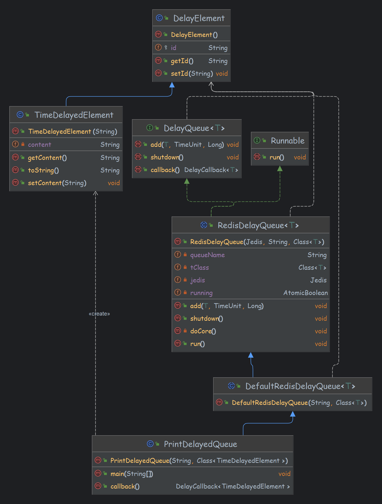

# redis raw delay
redis 实现原始延时队列

## 延时元素

继承 <code>DelayElement</code>

## 延时队列

继承 <code>DefaultRedisDelayQueue</code>, <code>RedisDelayQueue</code>, <code>DelayQueue</code>

## 延时元素处理

继承 <code>DelayCallback</code>

# demo PrintDelayedQueue

查看对应的 UML 关系

